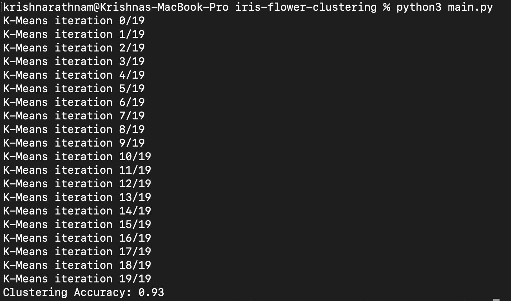

# Iris Clustering (K-Means from Scratch)

This project implements the K-Means clustering algorithm **entirely from scratch** using **NumPy**, applied to the classic Iris dataset. The only use of `scikit-learn` is to load the dataset; all clustering logic has been manually implemented to better understand the underlying math and mechanics of unsupervised learning.

## 📌 Features

- Custom implementation of K-Means algorithm
- Euclidean distance-based clustering
- Random centroid initialization
- Iterative centroid updating until convergence
- Cluster visualization (optional)
- No machine learning libraries used for the algorithm

## 📁 Dataset

- **Iris Dataset**
  - Loaded using `sklearn.datasets.load_iris()`
  - 150 samples, 4 features (sepal length, sepal width, petal length, petal width)
  - 3 classes (Setosa, Versicolor, Virginica) — used only for comparison, not training

## 🚀 How It Works

1. Randomly initialize `k` centroids (k=3 for this dataset)
2. Assign each data point to the nearest centroid using Euclidean distance
3. Recompute centroids as the mean of all points in each cluster
4. Repeat until centroids no longer change or max iterations reached

## 🛠 Tech Stack

- Python
- NumPy
- scikit-learn (only for loading dataset)

## 🧠 Learning Outcomes

- Deepened understanding of unsupervised learning
- Learned to implement mathematical concepts in code (e.g., distance metrics, vectorized operations)
- Gained insight into clustering behavior without black-box libraries

## 📷 Sample Output 



## 📂 Folder Structure

iris-clustering/
├── main.py       # Main implementation
├── README.md            # Project description

## ✅ To Run

```bash
python iris_kmeans.py
```
